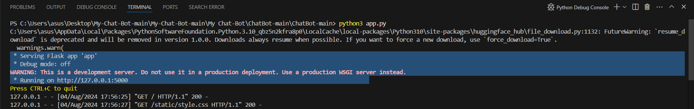

# My-ChatSonic

## Introduction

Welcome to the AI-ChatBot project! This chatbot utilizes state-of-the-art Natural Language Processing (NLP) algorithms to interact with users in a conversational manner. The bot is designed to understand and respond to natural language input, making it versatile for various applications such as customer support, personal assistance, and more.

# Features
* Natural Language Understanding (NLU): The chatbot can comprehend user inputs, identify intents, and extract relevant information. 
* Contextual Conversations: Maintains context during conversations, allowing for more coherent and meaningful interactions.
* Pre-trained Models: Utilizes advanced NLP models for accurate language understanding and generation.
* Customizable: Easily adaptable for different use cases and industries.
* Multi-platform Support: Can be integrated with various messaging platforms such as Slack, Telegram, and web interfaces.

# Technologies Used
* Python: The core programming language used for developing the chatbot.
* NLP Libraries: Leveraging libraries like NLTK, SpaCy, and Hugging Face's Transformers for language processing.
* Machine Learning: Implementing machine learning models for intent detection and response generation.
* Flask/Django: Used for developing the backend server.
* Template: Html,Css for designing the template.

# Installation
To get started with the AI-ChatBot, follow these steps:

## Clone the repository:

`git clone https://github.com/yourusername/AI-ChatBot.git`
`cd AI-ChatBot`

## Create and activate a virtual environment:

`python -m venv env`

source env/bin/activate

## On Windows use 
`env\Scripts\activate`

## Install the dependencies:

`pip install -r requirements.txt`

## Copy code

`python3 app.py`

##Access the chatbot:

Open your browser and go to http://localhost:5500.

Usage

Once the server is running, you can interact with the chatbot through the web interface or integrate it with supported messaging platforms. The bot can handle various types of queries and provide responses based on the implemented NLP models.

## Customization
To customize the chatbot for your specific needs, you can:

Modify the NLP models: Update the pre-trained models or train new ones on your dataset.
Add new intents and responses: Define new intents in the intents.json file and update the response generation logic.
Integrate with APIs: Enhance the chatbot's capabilities by integrating it with external APIs for more complex interactions.
Contributing
We welcome contributions to improve the AI-ChatBot! If you're interested in contributing, please fork the repository and submit a pull request. For major changes, please open an issue first to discuss what you would like to change.

## License
This project is licensed under the MIT License - see the LICENSE file for details.

## Contact
For any questions or feedback, please feel free to reach out:

Email: hanzalaansari674@gmail.com
GitHub: Hanzala13

